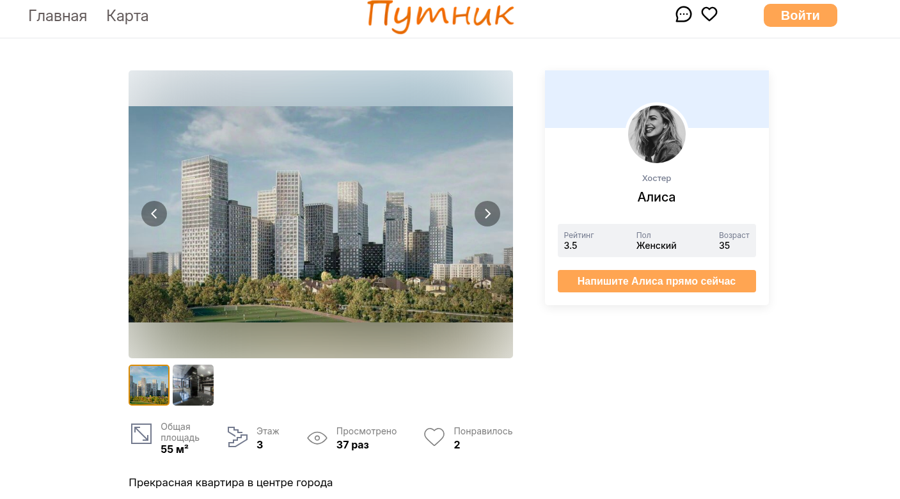
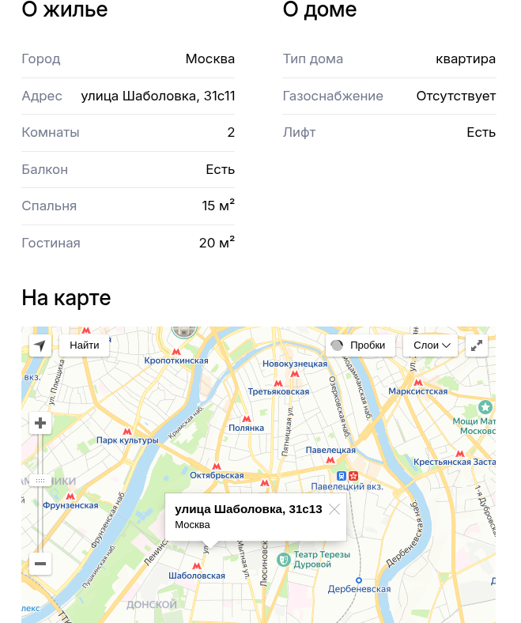

# Страница объявления

Браузер - Google Chrome Version 133.0.6943.141  
Мобильная версия - Google Chrome 133.0.6943.49

## Функционал

-   Пролистывание изображений
-   Увеличение и отдаление изображений
-   Отображение карты
-   Переход в профиль автора
-   Переход в чат с автором

### Пролистывание изображений в карусели

-   Пролистывание изображений в карусели происходит по нажатию на стрелки, которые появляются при наведении на карусель. Также можно нажать на превьюшки изображений под отображаемой фотографией, чтобы отобразить нужную фотографию. Третьим способом является перелистывание с помощью тачпада (либо же удержанием Shift и скроллом мышью).
-   Крайние случаи: если показывается последняя фотография, и нажимается кнопка для переключения на следующую фотографию, показывается первая. Происходит "зацикливание". Аналогично и с первой фотографией при нажатии на кнопку "Предыдущая фотография"

## Увеличение и отдаление изображений в карусели

При нажатии на изображение оно показывается на весь экран. При повторном нажатии на показанное изображение, оно уменьшается.

## Карта

В разделе "Карта" показывается адрес, указанный в объявлении, на Яндекс Картах.

## Переход в профиль

При нажатии на имя автора идет переход на профиль автора.

## Переход в чат с автором

При нажатии на "Напишите \*имя\* прямо сейчас" идет переход в чат с автором объявления.
