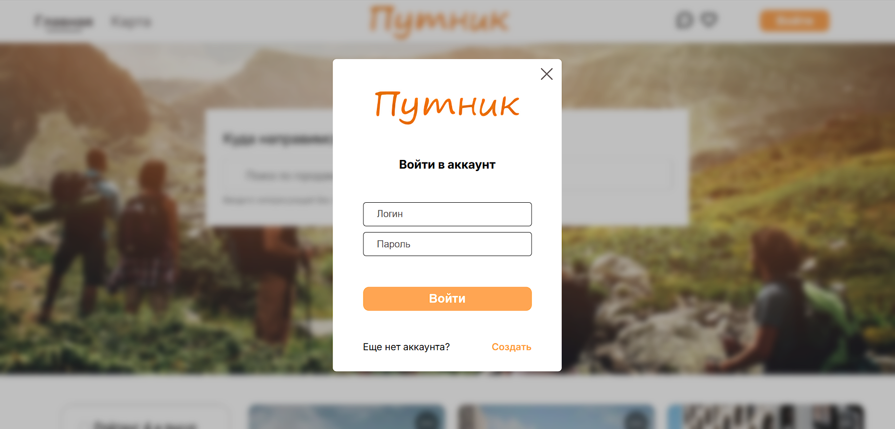
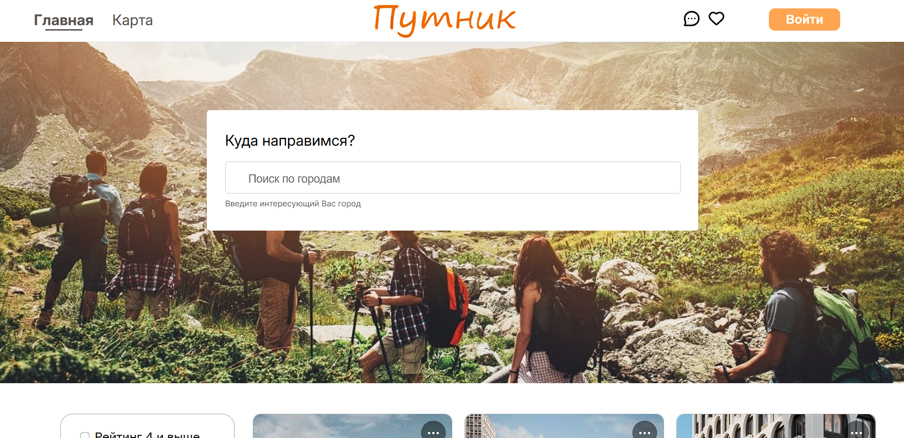
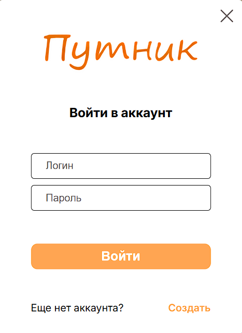
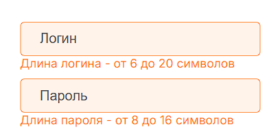
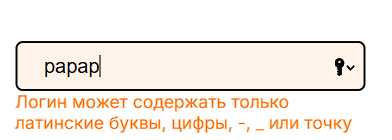
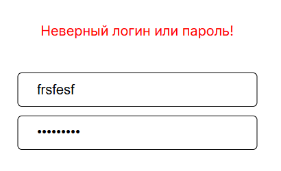
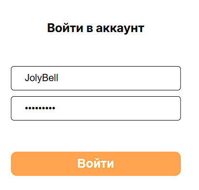
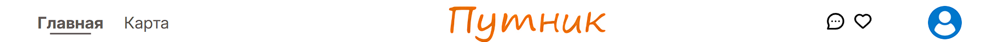

# Авторизация и регистрация

## Версия браузера

**Браузер** - *Google Chrome 134.0.6998.35*  
**Мобильная версия** - *Google Chrome 133.0.6943.49*

## Начало

- Будучи не авторизованными в шапке веб-сайта имеется кнопка "Войти", после нажатия которой появляется окно для авторизации.

- В окне есть два поля для логина и пароля пользователя, кнопка "Войти" и кнопка "Создать" для регистрации, если у пользователя отсутствует аккаунт.

## Авторизация

- При введении неверного формат данных в поле для логина, то под полем появится подсказка о том какой формат должны иметь данные для заполнение.
  

- Если заполнить поля неверными данными от аккаунта, то появится ошибка "Неверный логин или пароль!"

- При заполнении верными данными поля и нажатии кнопки "Войти" окно пропадает и в шапке веб-сайта вместо кнопки "Войти" появляется фотография аватара пользователя.

 
