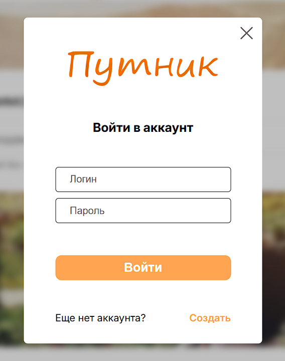

# Авторизация и регистрация

## Версия браузера

**Браузер** - *Google Chrome 134.0.6998.35*  
**Мобильная версия** - *Google Chrome 133.0.6943.49*

## Начало

- Будучи не авторизованными в шапке веб-сайта имеется кнопка "Войти", после нажатия которой появляется окно для авторизации.

- В окне есть два поля для логина и пароля пользователя, кнопка "Войти" и кнопка "Создать" для регистрации, если у пользователя отсутствует аккаунт.

## Авторизация

- Если поля оставить не заполненными и нажать кнопку "Войти", то под полями появятся подсказки про длины заполняемых данных.

- Если ввести неверный формат данных поле для логина, то под полем появится подсказка о том какой формат должно иметь данное для заполнение.

 
