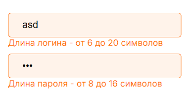

# Авторизация и регистрация

Ссылка: pootnick.ru

## Начало

-   Будучи не авторизованными в шапке веб-сайта имеется кнопка "Войти", после нажатия которой появляется окно для авторизации.

-   В окне есть два поля для логина и пароля пользователя, кнопка "Войти" и кнопка "Создать" для регистрации, если отсутствует аккаунт.

## Авторизация

-   Если ввести в поле для логина строку длиной меньше 6 или больше 20 символов и в поле пароль строку длиной меньше 8 или больше 16 символов, то под полями появятся подсказки о том какие длины должны иметь данные в полях.

-   При заполнении поля для логина символами из кириллицы под полем появится подсказка о том какие символы разрешены.

-   Если заполнить поля неверными данными от аккаунта, то появится ошибка "Неверный логин или пароль!"

-   При заполнении верными данными поля и нажатии кнопки "Войти" авторизация проходит успешно, происходит переход на главную страницу и в шапке веб-сайта вместо кнопки "Войти" появляется фотография аватара пользователя.

## Регистрация

-   При нажатии кнопки "Войти" происходит переход на авторизацию.
-   После нажатия кнопки "Создать" состав полей меняется для регистрации нового аккаунта.

-   Поля для логина и пароля аналогичны полям при авторизации. Но появляется еще одно поля для повторного ввода пароля. Если ввести не одинаковые строки в поля для пароля и его подтверждения, то появится подсказка, что пароли не совпадают.

-   Поле для имени имеет ограничения в длине и формате. Длина долна быть от 6 до 50 символов и имя может содержать только латинские и кириллические символы и пробелы. Соотвествующие подсказки появляются под полями.

-   Поле для почты должен соотвествовать формату "admin@example.com" и иметь длину от 6 до 40 символов. Подсказки при вводе неверных данных появляются под полями.

-   После ввода валидных данных и нажатия кнопки "Создать аккаунт" регистрация проходит успешно и происходит переход на главную страницу. Аналогично авторизации в шапке появляется фотография аватара пользователя и пропадает кнопка "Войти".

