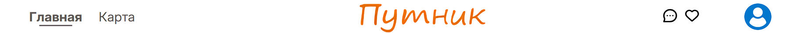

# Чат

## Версия браузера

**Браузер** - *Google Chrome 134.0.6998.35*  
**Мобильная версия** - *Google Chrome 133.0.6943.49*

## Начало

- Если нажать на кнопку "Напишите <имя пользователя> прямо сейчас!", на странице объявления, то произойдет переход на страницу чата с этим пользователем.

- При нажатии на кнопку чата в шапке веб-сайта происходит переход на страницу, где в левой части страницы все чаты с пользователями с которыми ранее велся диалог, а в правой части само окно чата, которое появляется при нажатии на соответсвующий чат с пользователем.

## Функционал чата

- В окне чатов с пользователями отображаются карточки, в которых содержатся имя пользователя, фотография аватара пользователя и последние сообщение в чате.

- В окне чата находится имя пользователя, с которым происходит диалог. В правой части окна сообщения, которые были отправлены, в левой - полученные сообщения. И также поле для ввода сообщения и кнопка для отправки сообщения.

- Рядом с каждым сообщением отображается время отправки.

