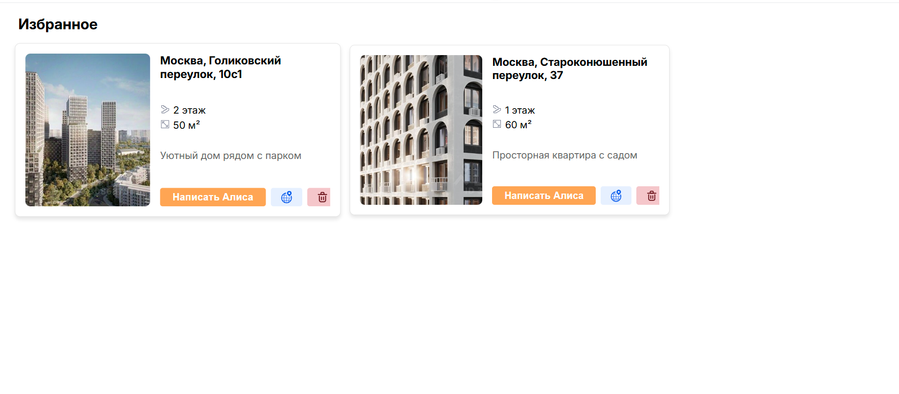
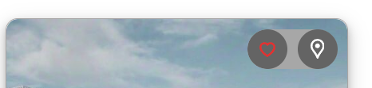
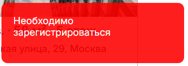
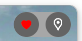
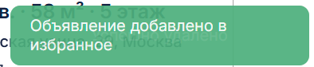
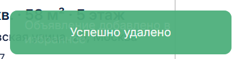
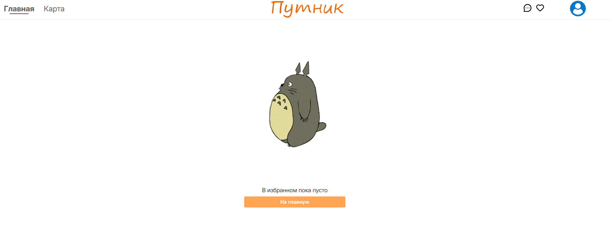
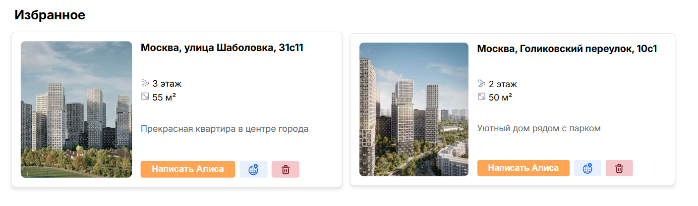
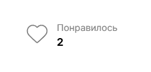

# Избранное

## Начало

Без авторизации:

-   При нажатии на кнопку избранного ничего не происходит\
    
-   При нажатии на кнопку добавления объявления в избранное\
    \
    Справа снизу экрана вылезает всплывающее сообщение о необходимости регистрации\
    

После авторизации:

-   При нажатии на кнопку избранного происходит переход на страницу избранного
-   При нажатии на кнопку добавления объявления в избранное кнопка меняет свое состояние на заполненное\
    \
    Справа снизу экрана появляется всплывающее сообщение об успешности добавления\
    
-   При повторном нажатии на кнопку добавления в избранное кнопка возвращается в изначальное состояние и справа снизу экрана появляется сообщение об успешном удалении из избранного\
    

## Страница избранного

-   При отсутствии избранных объявлений появится анимированная картинка, уведомляющая об этом\
    
-   При нажатии на кнопку "На главную" происходит переход на главную страницу сайта
-   При наличии избранных объявлений они отобразятся на странице\
    
-   При нажатии на кнопку "Написать <имя владельца>" происходит переход на страницу чата с владельцем
-   При нажатии на кнопку с изображением глобуса происходит переход на страницу карты с выделенным объявлением
-   При нажатии на кнопку корзины объявление удаляется из избранного
-   При наведении на объявление оно немного увеличивается в размерах
-   При нажатии на адрес объявления на карточке происходит переход на страницу объявления

## Страница объявления

-   На странице объявления можем увидеть у скольких человек данное объявление находится в избранном\
    
