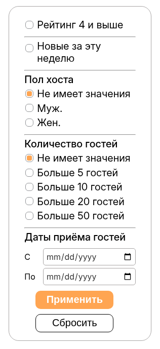
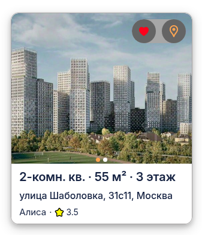
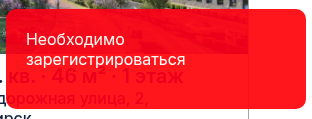
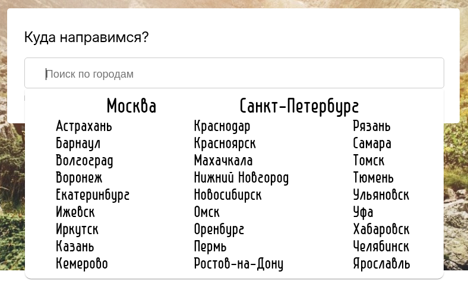

# Страница объявлений (Главная страница)

Браузер - Google Chrome Version 133.0.6943.141
Мобильная версия - Google Chrome 133.0.6943.49

## Функционал

-   Возможность применять/сбросить фильтры
-   Возможность взаимодействия с карточкой
-   Возможность вести поиск по городам

### Фильтры

-   При нажатии на элемент в группе (группа элементов -- это элементы, имеющие над собой заголовок) выбирается один из вариантов из всей группы
-   При нажатии на элемент вне группы, он либо активируется либо деактивируется
-   При выборе дат, появляется окно с выбором дат
-   BUG: можно выбрать диапазон, при котором дата "С" идет позже даты "По"

### Карточка

-   При наведении на карточку, можно пролистывать изображения как в карточках Ozon (в зависимости от расположения курсора на карточке, показывается нужное изображение)
-   При наведении на кебаб-меню, появляются 2 кнопки: "Добавить/убрать в избранное" и "Показать на карте"
-   При нажатии на кнопку "Добавить в избранное", объявление добавляется в избранное пользователя.
    -   если же пользователь неавторизован, то появляется соответствующее сообщение 
-   При нажатии на кнопку "Показать на карте" объявления показывается на карте

### Поиск по городам

-   При нажатии на "Поиск по городам" появляется список городов России, при нажатии на которые пользователь попадает на страницу с описанием города и объявлениями этого города
-   При вводе названия города появляется города, которые начинаются на поисковый запрос
-   При вводе города, которого не существует, выводится пустая плашка
-   BUG: Если ввести город, потом нажать на текстовое поле 2 раза, будут выводиться все города, невзирая на введеный город
