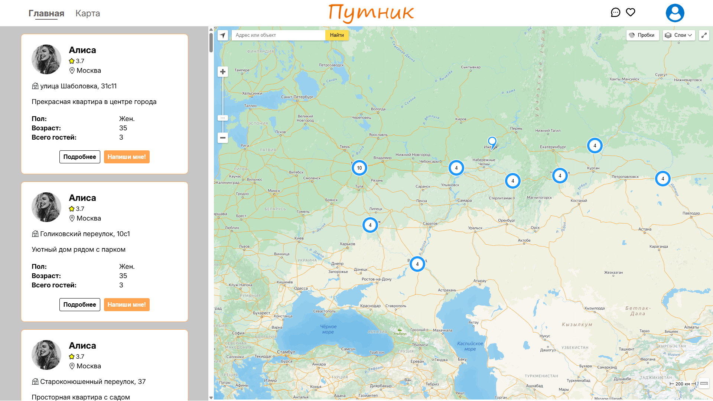
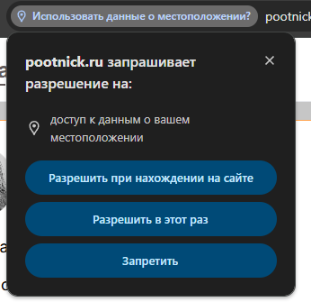
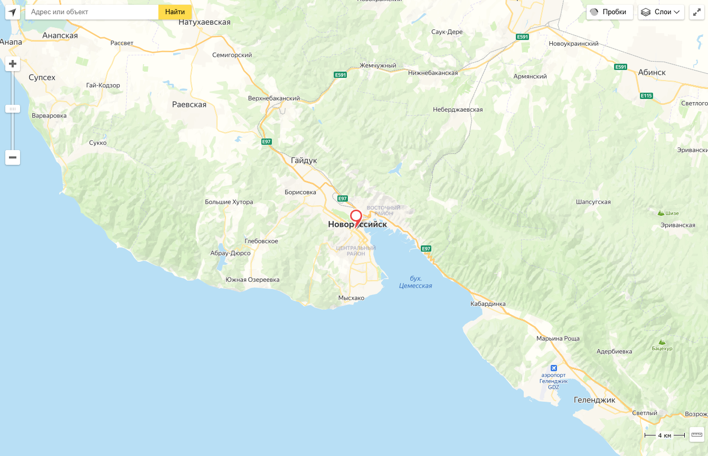
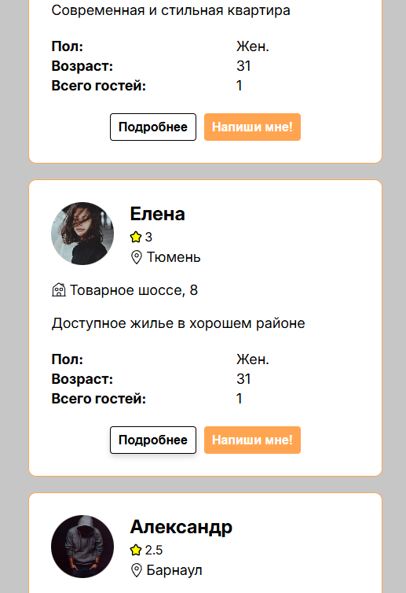
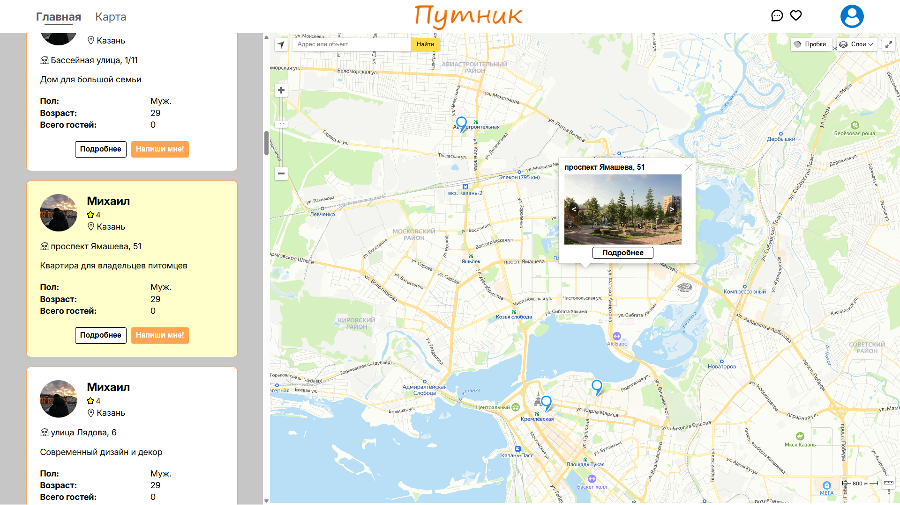

# Карта

Ссылка: https://pootnick.ru/map

## Начало

-   При открытии страницы с картой, сайт запрашивает доступ к местоположению

-   В случае выбора кнопок "Разрешить при нахождении на сайте" или "Разрешить в этот раз" на карте появится красная метка с вашим местоположением, а центр карты будет смещен на неё.
-   Если же выбрать "Запретить", то красной метки с местоположением пользователя не будет, и в центре карты будет Москва

## Колонка с объявлениями

-   При нажатии на карточку центр карты перемещается на метку с объявлением
-   При наведении на кнопки "Подробнее/Напиши мне!" под кнопками появляется тень
-   При снятии курсора с кнопок они возвращаются в обычное состояние

-   При нажатии на кнопку "Подробнее" происходит переход на страницу объявления.
-   При нажатии на кнопку "Напиши мне!" происходит переход на страницу чата с выбранным пользователем.

## Карта

### Функционал сайта

-   При маленьком масштабе метки объединяются в Кластеры с числом, показывающим количество объединенных меток. При нажатии на этот Кластер масштаб карты увеличивается, а метки распадаются.
-   При нажатии на метку колонка с объявлениями слева прокручивается до объявления, привязанного к этой метке. Объявление на секунду становится желтым, а затем плавно принимает обычный белый цвет.
-   При нажатии на метку, над ней всплывает балун. В балуне отображена улица и дом. Под ним фотографии из объявления, которые можно переключать с помощью кнопок влево и вправо. В самом низу балуна располагается кнопка "Подробнее".
-   При нажатии на кнопку балуна "Подробнее" происходит переход на страницу объявления. Балун можно закрыть, нажав на крестик в правом верхнем углу.  
     **BUG:** Если попытаться взаимодействовать с картинками на балуне (переключать влево/вправо) до того, как будут получены и прогружены все данные, то нажатие на кнопки не будет регистрировать нажатие, а картинки не будут переключаться.

