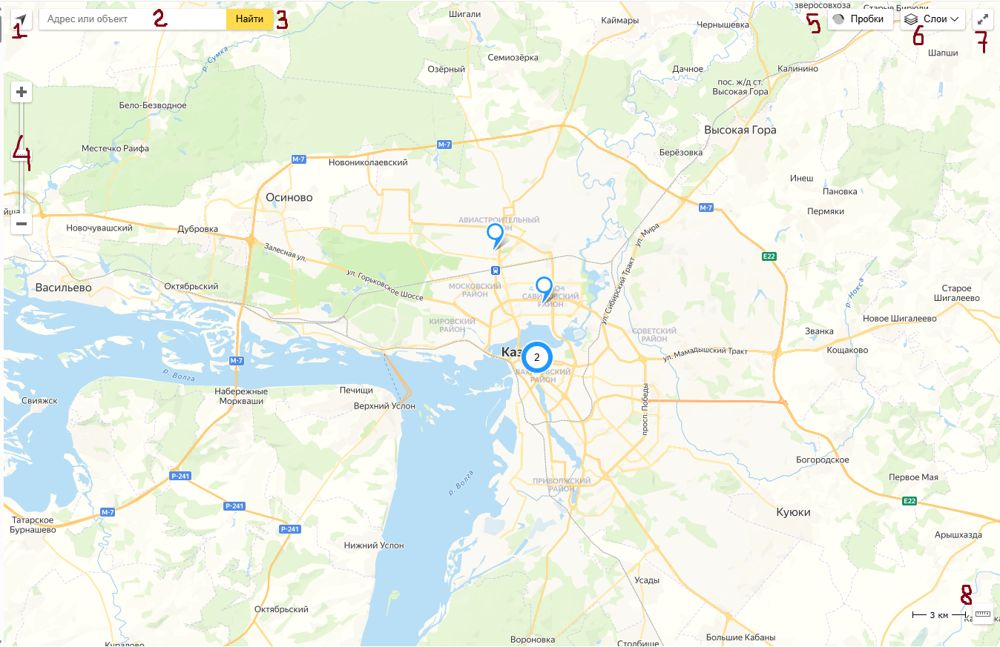

# Карта

## Начало

-   При открытии страницы с картой, сайт запрашивает доступ к местоположению

-   При нажатии кнопки "Разрешить при нахождении на сайте" браузер запомнит выбор и всегда будет предоставлять доступ к вашим геоданным.
-   При нажатии на кнопку "Разрешить в этот раз" доступ к вашим геоданным будет предоставлен единоразово, а запрос будет происходить каждый раз при заходе на страницу.
-   При нажатии на кнопку "Запретить" браузер не будет предоставлять доступ к вашим геоданным данному сайту.
-   В случае выбора кнопок "Разрешить при нахождении на сайте" или "Разрешить в этот раз" на карте появится красная метка с вашим местоположением, а центр карты будет смещен на неё.

## Колонка с объявлениями

-   При нажатии на карточку центр карты перемещается на метку с объявлением
-   При наведении на кнопки Подробнее/Напиши мне! под кнопками появляется тень
-   При снятии курсора с кнопок они возвращаются в обычное состояние

-   При нажатии на кнопку Подробнее происходит переход на страницу объявления.
-   При нажатии на кнопку Напиши мне! происходит переход на страницу чата с выбранным пользователем.

## Карта

### API Яндекс Карт

API Яндекс Карт предоставляет следующие возможности:

-   При нажатии на кнопку **"Определить ваше местоположение"** (**1**) на карте появляется метка в виде логотипа Яндекса, отображающая ваше текущее местоположение.
-   Справа находится поле для ввода адреса или объекта (**2**). При нажатии на кнопку **"Найти"** (**3**) появляется выпапдающий список из найденных объектов. При выборе чего-либо из выпадающего списка, происходит переход по карте на выбранный объект. На объекте появляется балун, на котором предлагается перейти в Яндекс.Карты или Исправить неточность.
-   С помощью кнопок **"+"** и **"-"**, а также вертикального слайдера (**4**) можно увеличить или уменьшить масштаб карты.
-   При нажатии на кнопку **"Пробки"** (**5**) дороги на карте приобретают цвет (от зелёного до красного), символизирующий их загруженность. На кнопке отображается текущее время и уровень пробок по 10-ти балльной шкале. При нажатии на кнопку с шестерёнкой есть возможность отобразить дорожные события, а также посмотреть статистику по загруженности дорог, основанную на пробказ за последние 2 месяца. При повторном нажатии на кнопку, режим Пробок отключается.
-   При нажатии на кнопку **"Слои"** (**6**) есть возможность видоизменить карту, выбрав режим "Схема", "Спутник" и "Гибрид", а также включить или отключить "Панорамы".
-   При нажатии на кнопку **"Расширить"** (**7**) карта занимает все доступное пространство на сайте. При повторном нажатии, карта возвращается в обычный режим.
-   При нажатии на кнопку **"Измерить расстояние на карте"** (**8**) включается режим, при котором можно выставить точки на карте в виде ломаной линии, а над ней отобразится её длина.

### Функционал сайта

-   При маленьком масштабе метки объединяются в Кластеры с числом, показывающим количество объединенных меток. При нажатии на этот Кластер масштаб карты увеличивается, а метки распадаются.
-   При нажатии на метку колонка с объявлениями слева прокручивается до объявления, привязанного к этой метке. Объявление на секунду становится желтым, а затем плавно принимает обычный белый цвет.
-   Кроме того, при нажатии на метку, над ней всплывает балун. В балуне отображена улица и дом. Под ним фотографии с объявления, которые можно переключать с помощью кнопок влево и вправо. В самом низу балуна располагается кнопка "Подробнее". При нажатии на неё происходит переход на страницу объявления, а кнопка немного опускается вниз. Балун можно закрыть, нажав на крестик в правом верхнем углу.  
    **BUG:** Если попытаться взаимодействовать с картинками на балуне (переключать влево/вправо) до того, как будут получены и прогружены все данные, то нажатие на кнопки не будет регистрировать нажатие, а картинки не будут переключаться.

