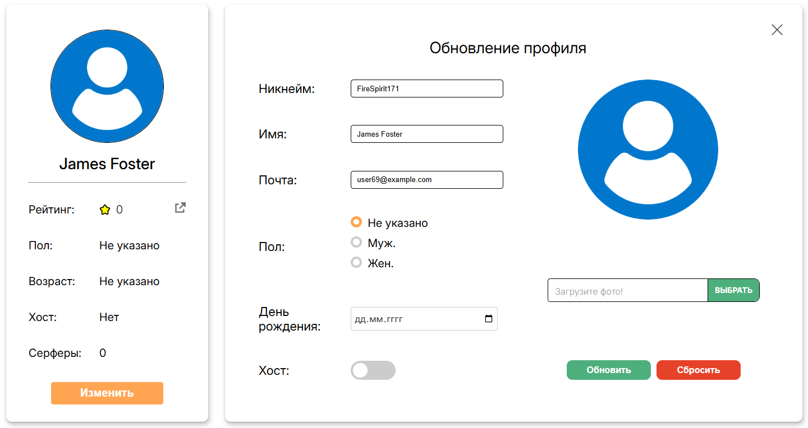

# Профиль

## Версия браузера

**Браузер** - *Google Chrome 134.0.6998.35*  
**Мобильная версия** - *Google Chrome 133.0.6943.49*

## Основная информация (левая колонка)

- При наведении курсора на иконку внешней ссылки, над иконкой появляется надпись "Следить за изменением рейтинга". Если курсор убрать - надпись пропадет.
- При нажатии на кнопку "Следить за изменением рейтинга" в правом виджете отобразится история рейтинга пользователя (при наличии отзывов) или анимированное изображение, свидетельствующее об отсутствии отзывов и, соответственно, истории рейтинга.  
**BUG:** Даты отзывов идут в обратном порядке, первая оценка является последней, и наоборот.

- При наведении курсора на кнопку "Изменить" под ней появляется тень. Если курсор убрать, тень пропадёт.
- При нажатии на кнопку "Изменить" в правом виджете отобразится форма изменения данных.

## Изменение данных

- Кнопка крестика в правом верхенем углу закрывает форму обновления данных и отображает Карту путешествий
- Первое поле "Никнейм" содержит никнейм пользователя. При нажатии курсора на это поле, появляется возможность редактировать его содержимое путём ввода с клавиатуры.  
**Ограничение:** Логин пользователя должен содержать от 6 до 20 символов.
- Второе поле "Имя" содержит Имя и Фамилию пользователя. При нажатии курсора на это поле, появляется возможность редактировать ФИО путём ввода с клавиатуры.  
**Ограничение:** Имя пользователя должно содержать от 6 до 50 символов.
- Третье поле "Почта" содержит почту пользователя. При нажатии курсора на это поле, появляется возможность редактировать почту путём ввода с клавиатуры.  
**Ограничение:** Почта должна содержать от 6 до 40 символов и иметь формат 'admin@example.com'
- Поле "Пол" дает возможность выбрать пол пользователя из 3-ёх вариантов: Не указано, Мужской и Женский.
- Поле "День рождения" дает возможность пользователю выбрать день своего рождения. Встроенный календарь браузера откроется при нажатии на иконку календаря справа. Кроме того, при нажатии на поле, есть возможность ввести дату рождения с клавиатуры.  
**Ограничение:** Диапазон дня рождения - с 01.01.1900 до сегодняшнего дня.
- Поле "Хост" является слайдером, благодаря которому можно поставить себе статус хоста. При нажатии кружок внутри слайдера сдвигается вправо, а его фон окрашивается в оранжевый цвет. Это соответствует значению Да. При повторном нажатии кружок слайдера сдвигается влево, а фон вновь становится серым. Это соответствует значению Нет.
- Поле справа предназначено для установки аватара пользователя. При нажатии на кнопку "Выбрать" или на само поле у пользователя появляется возможность загрузить фотографию со своего устройства. После загрузки фотографии на месте автарки справа появится предварительный вид нового аватара пользователя. Само поле будет содержать название загруженного файла.  
**Ограничение:** Разрешение файла не должно превышать 2000x500; доступное расширение - jpg, jpeg, img, png; максимальный размер - 5мб.
- При нажатии на кнопку "Сбросить" в правом нижнем углу во всех полях устанавливается текущие данные пользователя, предварительное фото сбрасывается.
- При нажатии на кнопку "Обновить" происходит отправка формы на сервер. В правом виджете будет отображаться Карта путешествий, а данные слева обновятся на актуальные.
**Ограничение:** Если сработало одно или несколько из вышеперечисленных ограничений, то напротив неверно установленного поля появится красный восклицательный знак, а границы поля станут красными. При наведении курсора на восклицательный знак появляется подробное описание ошибки.

## Карта путешествий

- При наведении курсора на любой регион он становится желтым, а справа от него появляется название субъекта РФ.

- При нажатии на серый регион он становится жёлтым, а внизу карты появляется форма с датами поездки.

- Поля "Начало поездки" и "Конец поездки" дают возможность пользователю выбрать начала и конца поездки. Встроенный календарь браузера откроется при нажатии на иконку календаря справа. Кроме того, при нажатии на поле, есть возможность ввести дату рождения с клавиатуры. Границы поля при этом станут оранжевыми.
**Ограничение:** Диапазон даты - с 01.01.1900 до сегодняшнего дня.
- После нажатия кнопки "Сохранить" карта перерисовывается, а выбранный регион становится зеленым  
**BUG:** Дата начала поездки может быть больше даты конца поездки.

- При нажатии на зелёный регион, он становится жёлтым, а снизу появляется кнопка "Удалить".

- При нажатии на кнопку "Удалить" карта перерисовывается, а выбранный регион становится серым.

## Отзывы

- При отсутствии отзывов на пользователя появится анимированная картинка, уведомляющая об этом.

- При наличии отзывов, они отобразятся в виджете

