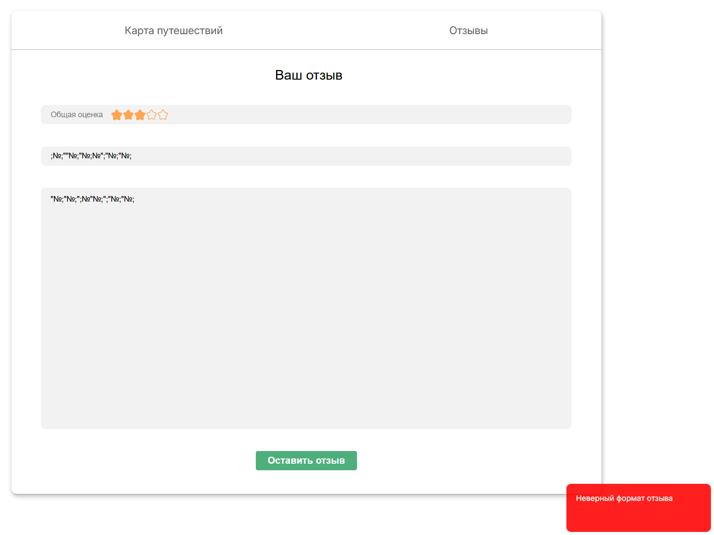

# Отзывы

## Начало

-   При нажатии на кнопку "Отзывы" на странице профиля другого пользователя можем увидеть список отзывов
-   В каждом отзыве указан автор, дата, заголовок, описание, оценка
-   В профиле пользователя указан средний рейтинг пользователя, составленный из отзывов
-   При нажатии на кнопку "Оценить" появляется окно для написания отзыва
    

## Оставление отзыва

-   Если при нажатии на кнопку "Оставить отзыв" оставить какое-либо поле незаполненным, то справа снизу экрана появится сообщение о необходимости заполнить все поля

-   При наведении на звезды общей оценки они буду увеличиваться или уменьшаться в зависимости от движения курсора
-   На нажатии на какую-либо звезду она и все звезды до нее становятся заполненными
-   При заполнении полей отзыва неправильными символами(любые символы кроме a-zA-Zа-яА-Я0-9@.,\s\-!?:;_/()*) и нажатии на кнопку "Оставить отзыв" вылезает сообщение о неверном формате отзыва
    **BUG**: После данного действия слева исчезает колонка с профилем пользователя

-   При нормальном заполнении отзыва(символами a-zA-Zа-яА-Я0-9@.,\s\-!?:;_/()*) и нажатии на кнопку "Оставить отзыв", создается отзыв, его можно увидеть в списке всех отзывов
-   Отзывы сортируются по дате добавления
