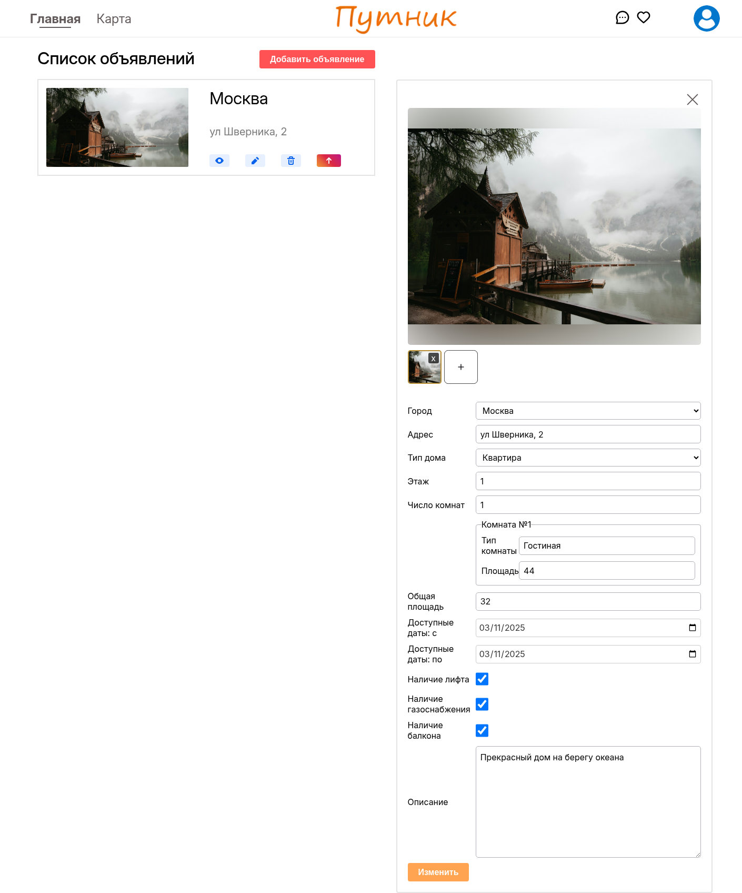
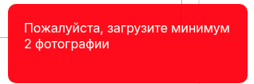
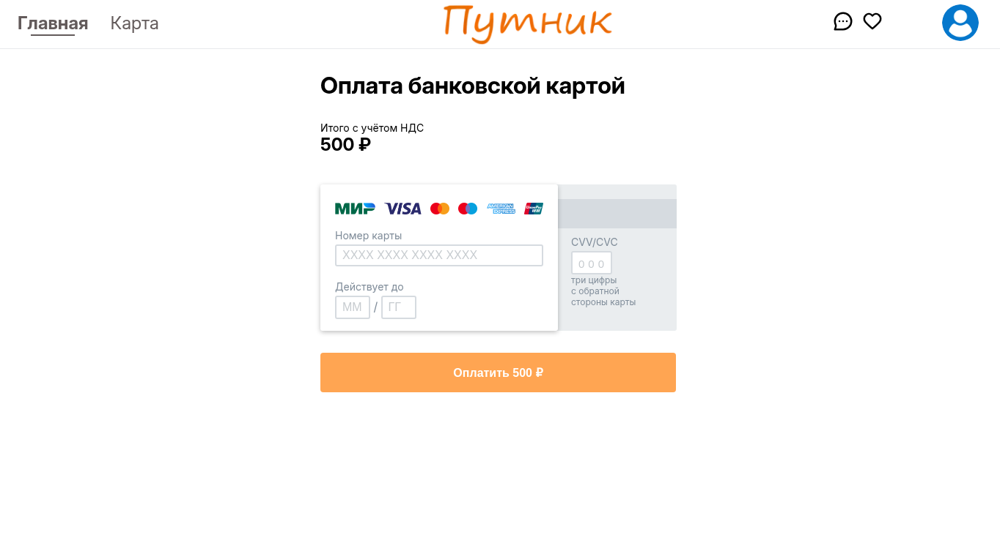
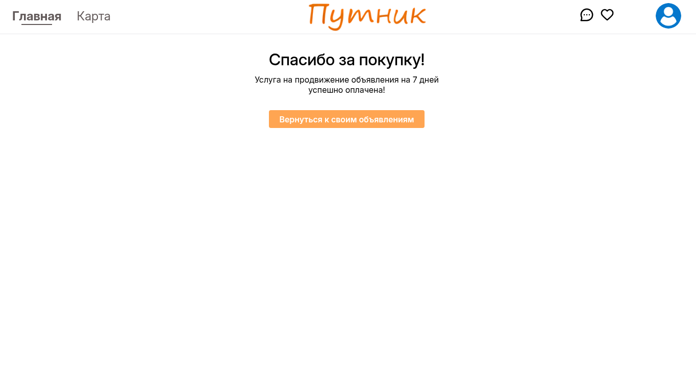
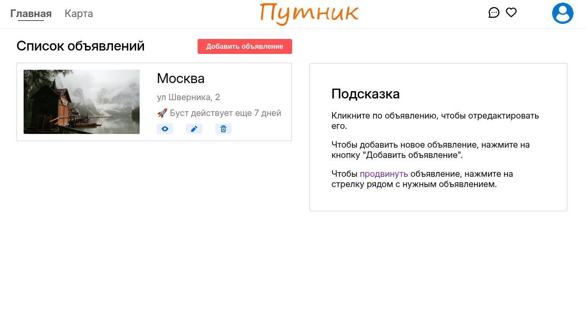

# Страница объявлений и редактирование объявлений

## Функционал

-   Просмотр список созданных объявлений
-   Удаление объявления
-   Редактирование объявления
-   Просмотр объявления
-   Буст объявления

### Просмотр списка созданных объявлений

Все созданные объявления отображаются

### Удаление объявления

При нажатии на корзину, объявление успешно, после чего пропадает из списка

### Редактирование объявления

При нажатии на изображение карандаша (или при обычном нажатии на карточку объявления), справа появляется меню редактирования этого объявления.

-   При нажатии на крестик в правой верхней части редактирования изображения, меню редактирования закрывается.
-   При нажатии на изображение, оно увеличивается на весь экран. При повторном нажатии, оно уменьшается.
-   При нажатии на крестик, рядом с превьюшкой изображения, оно удаляется из объявления.
-   При изменении поля "Число комнат", автоматически добавляются/убираются группы полей, которые называются "Комната №x", в которых содержатся информация о комнате
-   При нажатии на кнопку "Изменить" изменения применяются
    -   Если фотографий меньше 2, то появляется сообщение о необходимости загрузить больше фото  
        

### Просмотр объявления

При нажатии на изображение глаза, идет переход на страницу объявления.

### Буст объявления

-   При нажатии на изображение стрелки вверх, идет перенаправление на страницу оплаты.
    

-   После так называемой оплаты, появляется сообщение о активации продвижения (буста).  
    
-   После возвращения на страницу можно увидеть, что буст действует  
    
